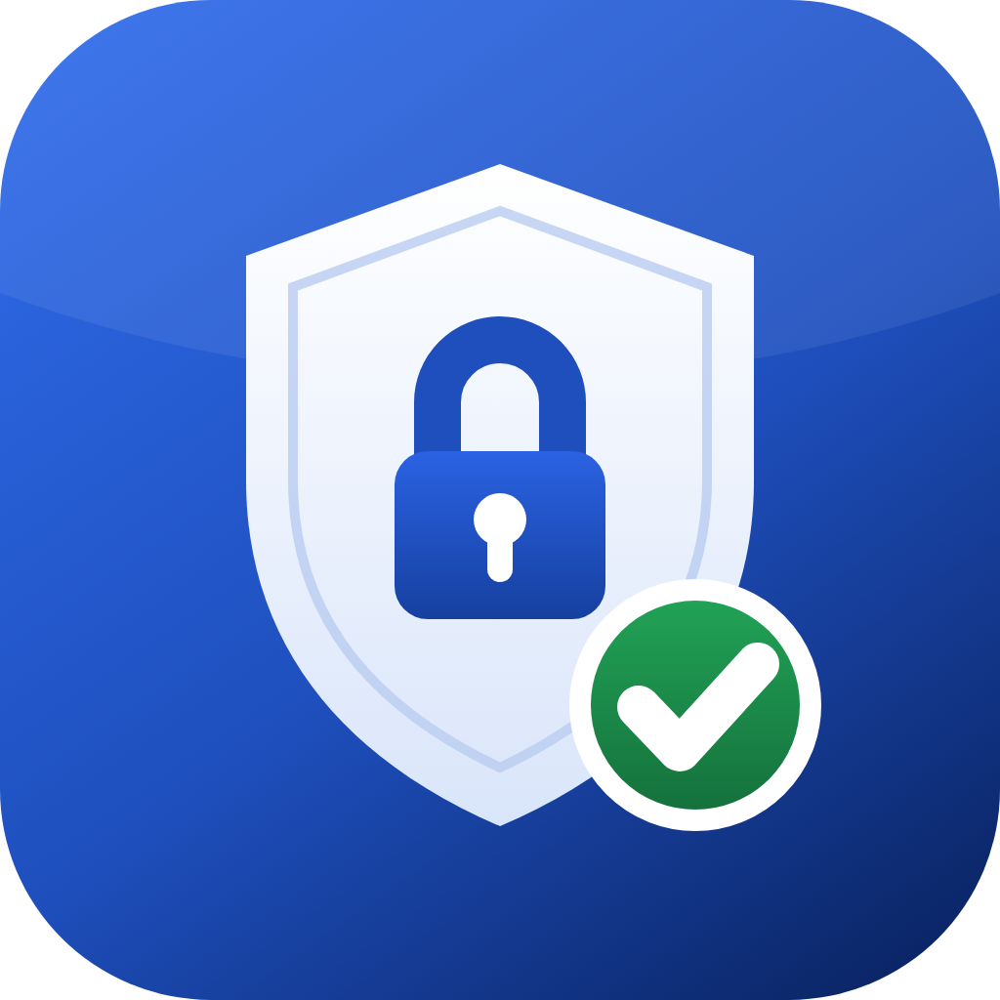
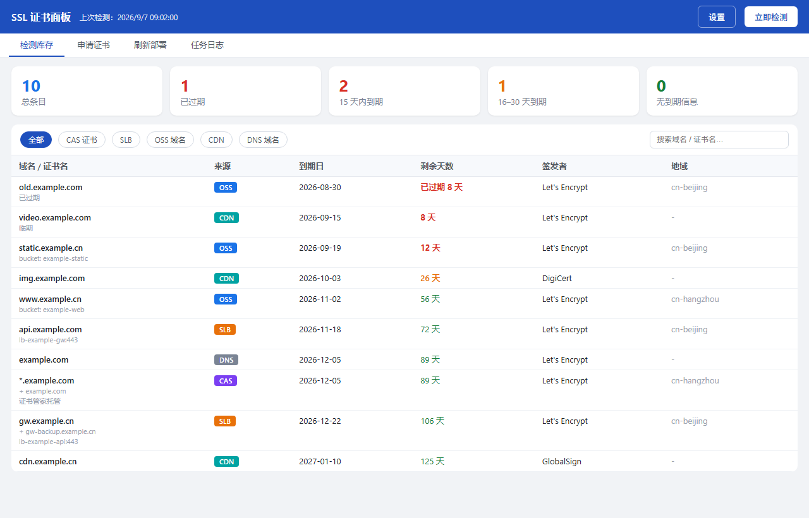
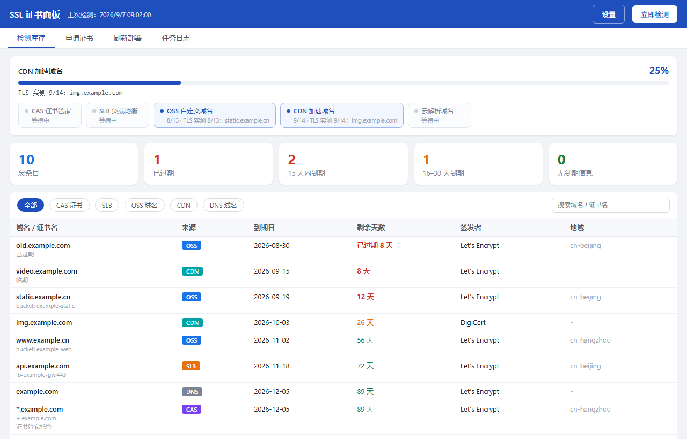
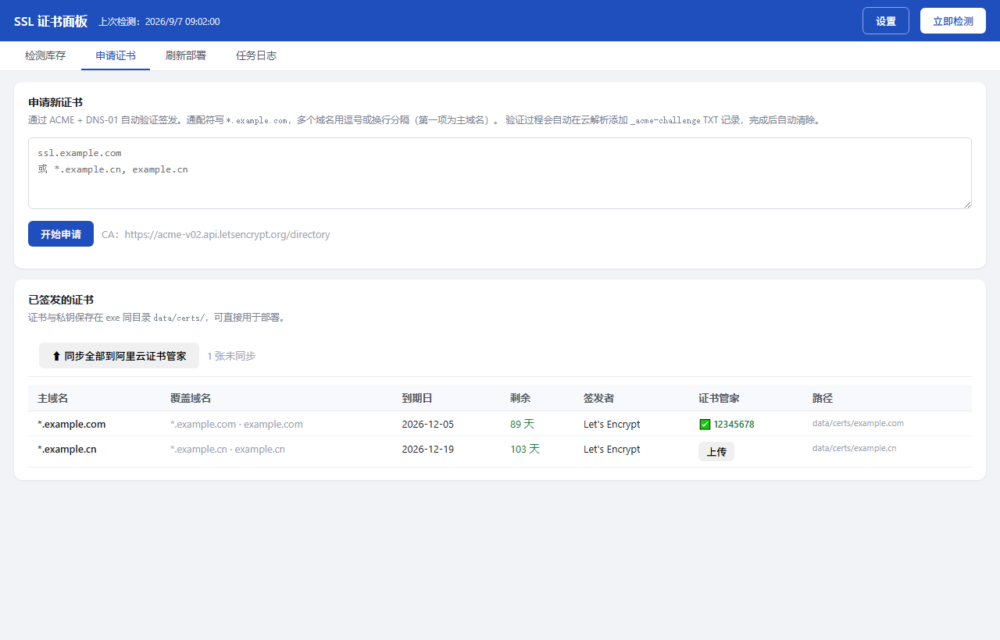
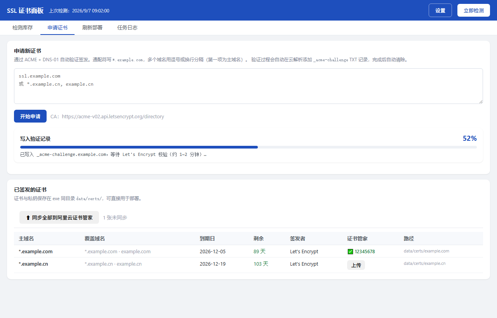
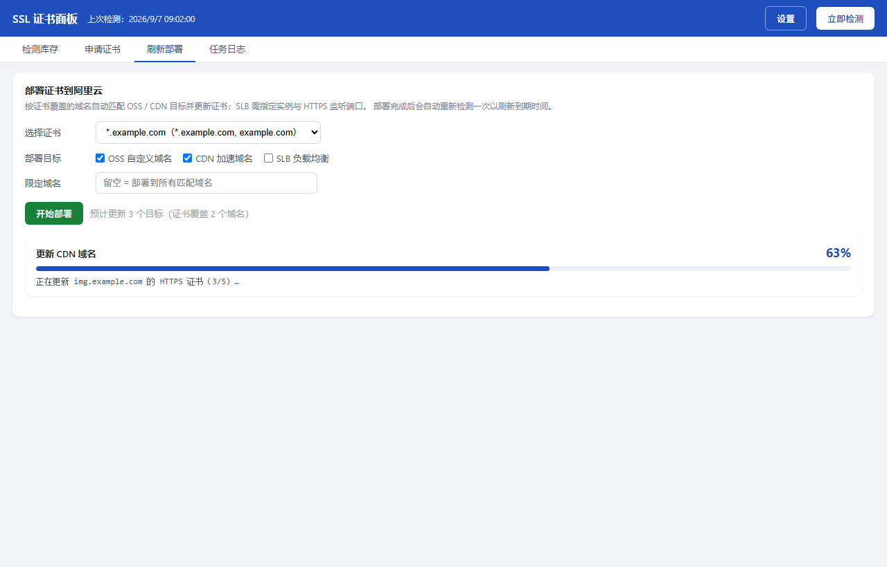
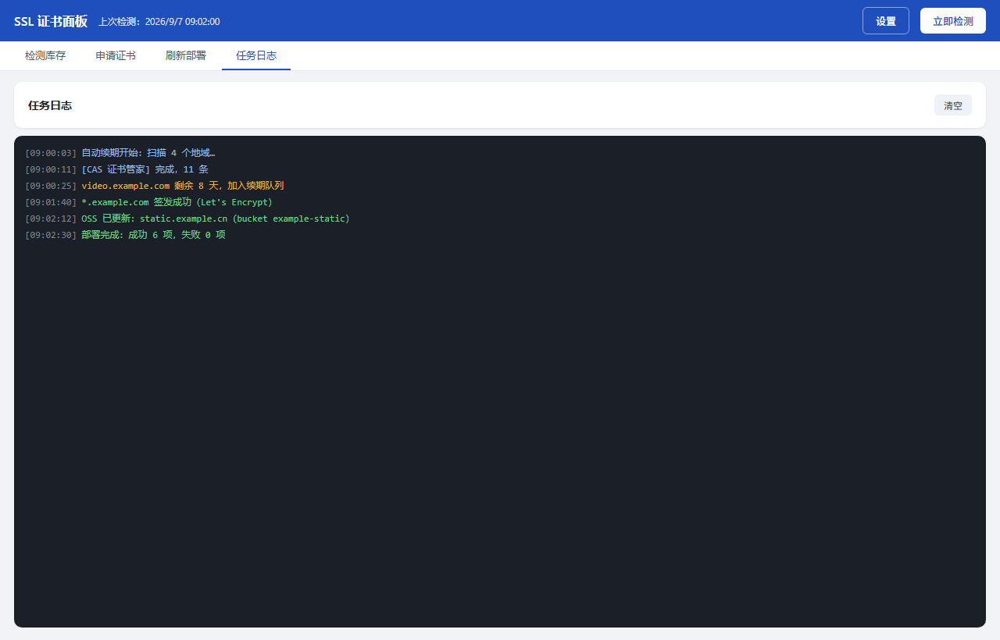
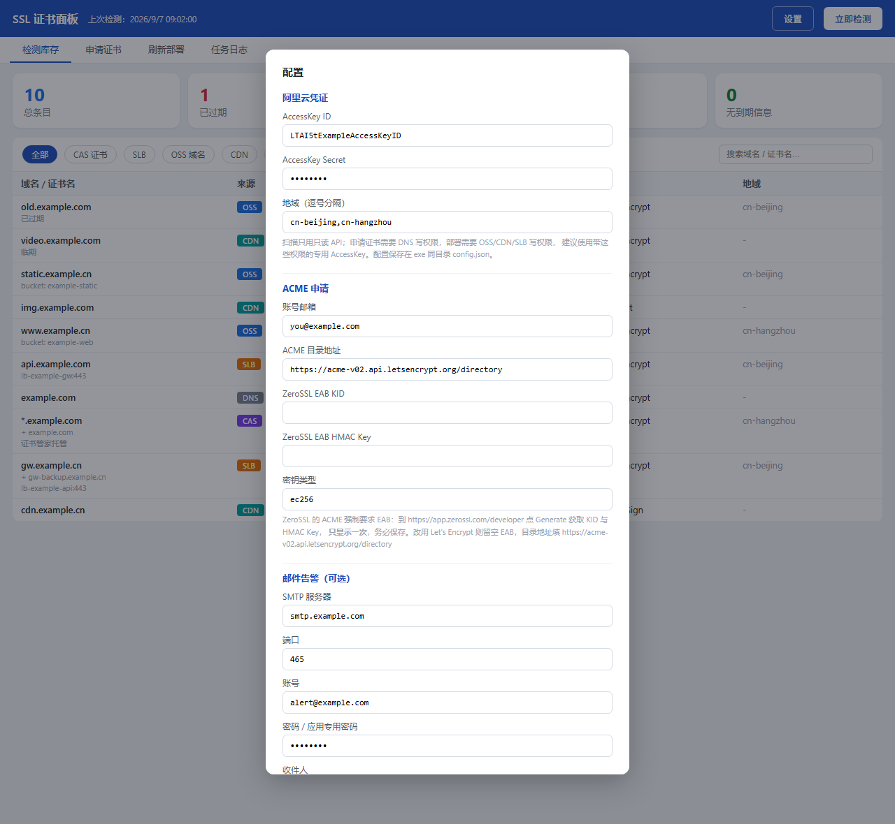

# aliyun-ssl-setup

<p align="center">
  
</p>

阿里云 SSL 证书桌面面板（Windows 单二进制，基于 Wails v2 + Go）。

覆盖证书全生命周期：**检测 → 申请 → 部署 → 续期提醒**。

- **检测**：扫描 CAS（证书管家）/ SLB / OSS / CDN / 云解析 DNS，汇总所有证书的有效期与绑定关系
- **申请**：lego + ACME DNS-01（支持 Let's Encrypt / ZeroSSL），自动写 TXT 验证记录，支持通配符与多域名 SAN
- **部署**：一键部署到 OSS 自定义域名 / CDN 加速域名 / SLB HTTPS 监听，部署后自动刷新检测结果

## 界面预览

> 以下截图均为内置示例数据（`tools/make_readme_shots.py` 生成，不含真实域名与凭证）。

**证书库存** —— 汇总 5 类云资源的证书，按剩余天数红/橙/绿分级，支持按来源筛选与搜索：



**检测实时进度** —— 点击「立即检测」后逐资源显示进度与阶段详情：



**申请证书 + 证书管家同步** —— ACME DNS-01 全自动签发；已签发证书可一键同步到阿里云证书管家：



**申请实时进度** —— 写 TXT → 等待校验 → 签发，全链路打点：



**部署实时进度** —— OSS / CDN / SLB 批量替换，逐项百分比：



**任务日志** —— 每一步操作都有可回溯的日志：



**设置** —— AccessKey / ACME / 邮件告警 / 无人值守自动续期，一站式配置：



## 编译

依赖：Go ≥ 1.25、Wails v2。Windows 下用 PowerShell 或 Git Bash 执行：

```bash
bash build.sh
```

产物：`build/bin/sslpanel.exe`（约 13 MB，免安装，无需浏览器）。

## AccessKey 配置

### 1. 配置文件位置

面板从 **exe 同目录**的 `config.json` 读取配置，**仅在启动时读取一次**——修改配置后必须重启面板。

首次运行前，在 `build/bin/` 下创建 `config.json`：

```json
{
  "access_key_id": "<你的 AccessKey ID>",
  "access_key_secret": "<你的 AccessKey Secret>",
  "regions": ["cn-beijing", "cn-hangzhou"],
  "acme_email": "you@example.com",
  "acme_dir_url": "https://acme-v02.api.letsencrypt.org/directory",
  "eab_kid": "",
  "eab_hmac": "",
  "key_type": "ec256"
}
```

> ⚠️ `config.json` 含真实凭证，已被 `.gitignore` 排除，**严禁提交到仓库**。

### 2. 字段说明

| 字段 | 必填 | 说明 |
|------|:---:|------|
| `access_key_id` / `access_key_secret` | ✅ | 阿里云 AK 对，检测 + 申请 + 部署共用 |
| `regions` | ✅ | 扫描的地域列表，如 `cn-beijing`、`cn-hangzhou` |
| `acme_email` | ✅（申请时） | ACME 账号邮箱，CA 到期通知发到该邮箱 |
| `acme_dir_url` | ❌ | ACME 目录地址。默认 ZeroSSL；用 Let's Encrypt 填 `https://acme-v02.api.letsencrypt.org/directory` |
| `eab_kid` / `eab_hmac` | 视 CA | ZeroSSL 强制 EAB（控制台 Developer 页生成）；**Let's Encrypt 留空即可** |
| `key_type` | ❌ | 证书密钥类型：`ec256`（默认推荐）/ `rsa2048` / `rsa4096` |

### 3. RAM 权限要求

建议 RAM 用户 + 最小权限，**不要用主账号 AK**。面板需要两类权限：

**① 只读权限（检测功能）**：挂系统策略 `AliyunReadOnlyAccess`。

**② 写权限（申请 + 部署功能）**：自定义策略，最小 Action 集如下（完整可复制版本见 [`docs/ram-policy-ssl-deploy.json`](docs/ram-policy-ssl-deploy.json)）：

| Action | 用途 |
|--------|------|
| `alidns:AddDomainRecord` / `DeleteDomainRecord` | ACME DNS-01 验证（写/删 TXT 记录） |
| `yundun-cert:UploadUserCertificate` | 上传证书到证书管家（注意前缀是 **`yundun-cert:`**，不是 `cas:`） |
| `oss:PutCname` | OSS 自定义域名挂证书 |
| `cdn:SetCdnDomainSSLCertificate` | CDN 域名挂证书 |
| `slb:UploadServerCertificate` / `SetLoadBalancerHTTPSListenerAttribute` | SLB 挂证书 / 更新 HTTPS 监听 |

> 已知坑：CAS 新版 API（2020-04-07）的 RamCode 是 `yundun-cert`，策略里写 `cas:UploadUserCertificate` 不生效，会报 `NoPermission`。

### 4. 权限自检方法

无需真实写操作即可验证 AK 权限——用**无效参数**调用写 API：权限不足会报 `Forbidden`/`NoPermission`，权限正常则报业务错误（如"域名不存在"）：

```bash
aliyun alidns AddDomainRecord --DomainName "test.invalid" --RR t --Type TXT --Value v
aliyun cas UploadUserCertificate --Name "t"
aliyun cdn SetCdnDomainSSLCertificate --DomainName "test.invalid" --SSLProtocol on
aliyun slb UploadServerCertificate --RegionId cn-beijing
```

## 日常维护

### AK 轮换

1. RAM 控制台为对应用户创建新 AccessKey（保留旧的）
2. 更新 `config.json` 中的 AK → 重启面板 → 点「立即检测」确认 116+ 条扫描正常
3. 确认无误后禁用/删除旧 AK
4. 若同 AK 还用于其他系统（如每日巡检脚本），同步更新各处配置后再删旧 AK

建议每 6~12 个月轮换一次；AK 泄露（误提交 git、截图露出等）立即轮换。

### 证书续期

- 证书 90 天有效期，面板检测页按剩余天数排序，剩余 < 30 天标黄、< 7 天标红
- 续期 = 面板里重新「申请」+「部署」，账号密钥（`account.key`）自动复用，无需重新注册
- Let's Encrypt 有速率限制：同一域名每周 5 张重复证书，正常续期足够

### 无人值守自动续期（一键续期 + 每日定时）

**配置位置**：设置页 → 「无人值守自动续期」区块（对应 `config.json` 字段）

```json
{
  "auto_enabled": true,
  "auto_hour": 9,
  "auto_threshold": 15,
  "auto_targets": ["oss", "cdn", "slb"],
  "smtp_host": "smtp.qq.com",
  "smtp_port": 465,
  "smtp_user": "你的邮箱",
  "smtp_pass": "授权码",
  "mail_to": "收件邮箱",
  "mail_from": ""
}
```

| 字段 | 说明 |
|------|------|
| `auto_enabled` | 是否开启每日自动续期（**需保持面板运行**，定时器在面板进程内） |
| `auto_hour` | 每天几点执行（0-23，默认 9） |
| `auto_threshold` | 剩余天数低于此值触发续期（默认 15 天） |
| `auto_targets` | 允许自动替换证书的服务：`oss` / `cdn` / `slb` |
| `smtp_*` / `mail_to` / `mail_from` | 邮件汇总（未配置则只写本地日志，不影响续期执行） |

**自动执行流程**（每天到点自动跑，也可在设置页点「立即执行一次」手动触发）：

```
扫描全部资源 → 挑出剩余天数 < 阈值的证书
  → 按「原证书域名组合」分组（一张通配符证书覆盖的所有服务算一组，只签一次）
  → 重新签发 → 上传到证书管家 → 自动替换回原挂载位置
  → 邮件汇总（签发/部署/失败清单）
```

关键设计说明：

- **通配符证书跨服务复用**：分组优先匹配本地已签发证书（`data/issued.json`）的域名组合，保证续出来的仍是同样的 SAN 结构；一组证书只申请一次，然后批量部署到所有覆盖的域名
- **SLB 按监听匹配**：只替换「当前使用的服务器证书已临期」的 HTTPS 监听，不会误动其他监听
- **证书管家（CAS）来源的证书不自动续**：避免与阿里云托管证书的续期逻辑冲突
- **并发保护**：自动任务与手动操作共用忙锁，任务进行中不会重复触发

⚠️ 面板内定时器的前提是**面板保持运行**（最小化即可，不能退出）。若要求关机后也能跑，可改用 Windows 任务计划程序定时启动 exe（后续版本可加 `--auto` 无窗口模式）。

### 故障排查

| 现象 | 排查 |
|------|------|
| 窗口白屏 / 闪退 | 多显卡或远控（ToDesk 等）环境导致 WebView2 GPU 崩溃，本仓库 `main.go` 已内置 `WebviewGpuIsDisabled` 修复；若自行改造请保留 |
| 检测报权限错误 | AK 被改过权限，按上文重新自检 |
| 申请报 "ACME 账号注册失败" | ZeroSSL 需填 EAB；或改用 Let's Encrypt（`acme_dir_url` 换成 LE 地址、EAB 留空） |
| 部署报 NoPermission | 对照第 3 节权限表，重点检查 `yundun-cert:` 前缀 |
| 改了 config.json 不生效 | 重启面板（启动时读取一次） |

### 目录结构

```
sslpanel-app/
├── main.go                 # Wails 入口（含 WebView2 崩溃修复开关）
├── app.go                  # 配置加载 / 任务编排 / 事件推送
├── internal/
│   ├── aliyun/             # 阿里云 RPC 客户端 + 资源扫描
│   ├── acme/               # ACME 申请（lego）+ 阿里云 DNS Provider
│   ├── deploy/             # OSS / CDN / SLB 部署
│   └── store/              # 任务记录存储
├── frontend/dist/          # 前端单文件（无 npm 依赖）
├── tools/probe/            # 无头进度探针（验证后端扫描链路）
├── docs/                   # RAM 权限策略等文档
└── build.sh                # 一键编译脚本
```
